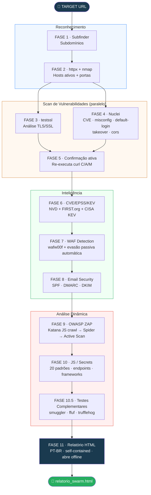

# SWARM

> Scanner de segurança web automatizado — pipeline de 11 fases desde a descoberta de subdomínios até análise de secrets em JavaScript, entregando um relatório HTML completo em Português orientado a tech leads e gestores de segurança.

[](https://www.gnu.org/software/bash/)
[](https://www.python.org/)
[](#instalação)
[](#uso)
[](LICENSE)

---

## Arquitetura



---

## O que o SWARM faz

Um comando. Um relatório. Cobertura completa.

```bash
# Scan único
bash swarm.sh https://target.com

# Múltiplos alvos via arquivo
bash swarm_batch.sh targets.txt
```

O SWARM encadeia 10+ ferramentas de segurança em um pipeline automatizado e entrega um único relatório HTML em Português com evidências completas, impacto em linguagem de negócio e plano de ação por horizonte.

### Para quem é

| Perfil | O que recebe |
|---|---|
| **Analista de segurança** | Evidência completa (request/response brutos, curl commands), CVSS + EPSS, deduplicação por tipo, TLS findings |
| **Tech lead** | Impacto em linguagem de negócio, orientação de correção por tecnologia, plano de ação em 3 horizontes |
| **Gestor de segurança** | Índice de risco 0–100 ponderado por EPSS, comportamento do scan, duração, sumário executivo |

---

## Pipeline de 11 Fases

```
FASE 1   Subfinder ────────────────── Subdomínios
FASE 2   httpx + nmap ─────────────── Hosts ativos + portas
FASE 3   testssl ───────────────┐
                  (background)  │ paralelo
FASE 4   Nuclei ────────────────┘
         CVE + misconfig + default-login + exposure
         + takeover + cors
FASE 5   Confirmação ativa (apenas C/A/M)
         Re-executa curl de cada achado Nuclei
FASE 6   Enriquecimento CVE / EPSS / KEV (NVD + FIRST.org + CISA)
         CVSS v3 · EPSS · exploração ativa confirmada (KEV) · retry backoff
FASE 7   Detecção de WAF (wafw00f)
         + evasão passiva automática quando detectado
FASE 8   Segurança de Email (SPF / DMARC / DKIM)
         Análise DNS sem ferramentas extras
FASE 9   OWASP ZAP
         Katana JS crawl → Spider → Active Scan
         OpenAPI/Swagger auto-import
FASE 10  JS / Secrets
         20 padrões · endpoints · frameworks vulneráveis
FASE 10.5 Testes Complementares
         HTTP Smuggling · Fuzzing de endpoints (ffuf) · Trufflehog
FASE 11  Relatório HTML
         PT-BR · self-contained · abre offline
```

---

## Cobertura

### Reconhecimento
- **Enumeração de subdomínios** — subfinder com fallback automático para domínio principal
- **Mapeamento HTTP** — hosts ativos, status codes, tecnologias (httpx)
- **Scan de portas** — 80, 443, 8000, 8080, 8443, 8888, 3000, 9090

### TLS / SSL
- Versões de protocolo (SSLv3, TLS 1.0/1.1/1.2/1.3)
- Cipher suites fracos e configurações inseguras
- Validade de certificado, cadeia de confiança, HSTS
- CVEs conhecidos: Heartbleed, POODLE, BEAST, ROBOT, DROWN

### Scan de Vulnerabilidades (Nuclei)
- **CVE templates** — vulnerabilidades em versões específicas de software
- **Default credentials** — Node-RED, Grafana, Jupyter, Jenkins, e outros
- **Misconfiguration** — configs expostos, debug endpoints, stack traces
- **Exposure** — S3 buckets públicos, repos Git expostos, arquivos de backup
- **Subdomain takeover** — CNAME apontando para serviços desativados
- **CORS misconfiguration** — reflexão de origin, null origin, wildcard
- **Confirmação ativa** — re-executa o curl do Nuclei (só C/A/M) para verificar se ainda é explorável

### Inteligência CVE — Metodologia KEV > EPSS > CVSS
- **CISA KEV** — catálogo *Known Exploited Vulnerabilities* baixado a cada scan. Um CVE no KEV é tratado como urgente independente do score CVSS — exploração ativa em ambiente real pesa mais que severidade teórica
- **NVD** — CVSS v3, descrição oficial por CVE
- **EPSS** — probabilidade de exploração nos próximos 30 dias (FIRST.org)
- **Retry com backoff exponencial** — trata rate limiting do NVD (6s → 12s → 24s)
- **Risk score 2026: KEV (+25/CVE) > EPSS (+15/+7/+2) > CVSS (base ponderada) > JS secrets**

### Metodologia de Classificação de Criticidade

O SWARM usa uma metodologia de priorização em 4 camadas, alinhada com as recomendações atuais do NIST e CISA para 2026. A lógica central é: **evidência de exploração real supera severidade teórica**.

#### Camada 1 — KEV (peso máximo)
O catálogo [CISA Known Exploited Vulnerabilities](https://www.cisa.gov/known-exploited-vulnerabilities-catalog) responde à pergunta: *"essa vulnerabilidade está sendo explorada em ambiente real agora?"*. Um CVE no KEV recebe +25 pontos no risk score independente do CVSS. Motivo: uma falha CVSS 6.5 com exploração ativa confirmada é operacionalmente mais urgente que uma falha CVSS 9.8 sem exploração documentada.

#### Camada 2 — EPSS (probabilidade futura)
O [Exploit Prediction Scoring System](https://www.first.org/epss) da FIRST.org estima a probabilidade de um CVE ser explorado nos próximos 30 dias com base em dados de ameaças em tempo real. Bônus aplicado:
- EPSS ≥ 50% → +15 (exploit muito provável)
- EPSS ≥ 10% → +7  (exploit provável)
- EPSS ≥ 1%  → +2  (exploit possível)

#### Camada 3 — CVSS v3 (severidade base)
O Common Vulnerability Scoring System fornece a base técnica de severidade. Usado como ponto de partida, não como critério exclusivo de prioridade. Limitação conhecida: o NIST passou a priorizar enriquecimento NVD apenas para CVEs no KEV e softwares críticos — CVEs recentes podem não ter CVSS disponível imediatamente.

#### Camada 4 — Validação ativa
O SWARM re-executa o curl de cada achado Nuclei classificado como C/A/M para confirmar se a vulnerabilidade é explorável no momento do scan. Um achado confirmado ativamente tem prioridade máxima independente das camadas anteriores.

#### Fórmula do Risk Score (0–100)

```
base_risk  = (críticos × 10) + (altos × 5) + (médios × 2) + baixos
kev_bonus  = min(CVEs_no_KEV × 25, 50)
epss_bonus = Σ bônus por CVE conforme faixas EPSS
js_bonus   = min(secrets_críticos × 15 + secrets_médios × 5 + fw_vulneráveis × 8, 30)
risk       = min(base_risk + kev_bonus + epss_bonus + js_bonus, 100)
```

| Score | Classificação | Ação recomendada |
|---|---|---|
| 70–100 | CRÍTICO | Ação imediata — escalar hoje |
| 40–69 | ALTO | Atenção urgente — corrigir esta sprint |
| 15–39 | MÉDIO | Correção planejada — próximo sprint |
| 0–14 | BAIXO | Monitoramento — backlog |

### WAF Detection & Evasão Passiva
- **wafw00f** — detecta 140+ WAFs (Cloudflare, AWS WAF, Imperva, Akamai, F5, Sucuri, etc.)
- **Quando WAF detectado**, o SWARM adapta o pipeline automaticamente:
  - **Rate limit** — reduz para 5 req/s com delay randômico de 1–3s entre requests
  - **User-Agent rotation** — troca para UA de browser real (Chrome, Firefox, Safari, Edge)
  - **Origin spoofing** — injeta `X-Forwarded-For: 127.0.0.1` e `X-Real-IP: 127.0.0.1`
  - **Payload alterations** — Nuclei testa variações de encoding automaticamente (`-pa`)
  - **WAF response handling** — ignora 403/406/429 e continua o scan
  - **ZAP threads** — reduz para 2 para imitar tráfego humano
- Relatório inclui seção **"Comportamento do Scan"** com todas as técnicas aplicadas e resultados obtidos

### Segurança de Email (DNS-based, sem ferramentas extras)
- **SPF** — detecta ausente, `+all` (qualquer remetente), `?all` (neutro), correto
- **DMARC** — detecta ausente, `p=none` (monitor only), `p=quarantine/reject`
- **DKIM** — verifica seletores comuns (`default`, `google`, `mail`, `s1`, `s2`, etc.)
- Tabela no relatório com status, severidade e recomendação específica por protocolo

### Testes Complementares (Fase 10.5)
- **HTTP Request Smuggling** (`smuggler.py`) — testa variantes CL.TE, TE.CL e CL.0 contra proxies reversos
- **Fuzzing de endpoints** (`ffuf`) — descobre rotas ocultas (`/admin`, `/backup`, `.env`, `/api/v2/internal`) com wordlist seclists
- **Secrets de alta confiança** (`trufflehog`) — analisa os arquivos JS coletados em busca de credenciais com verificação ativa
- Todas as ferramentas são **opcionais** — o scan continua normalmente se não estiverem instaladas

### Análise Dinâmica (Katana + OWASP ZAP)
- **Katana** — crawl com rendering JavaScript headless via chromium (`-jc -jsl`)
- Injeção das URLs descobertas no contexto ZAP antes do spider
- **OpenAPI/Swagger auto-import** — detecta e importa specs de API antes de escanear
- **Active Scan** — XSS, SQLi, CSRF, bypass de auth, IDOR
- **Deduplicação** — um card por tipo de alerta com lista completa de URLs afetadas
- **Reclassificação CVSS** — tabela CWE→CVSS sintético com 37 entradas
- **Detecção de scan travado** — aborta active scan após 90s em 0% com diagnóstico
- **Evidência completa** — request/response HTTP bruto do ZAP XML incluído no relatório

### JavaScript & Secrets
- **Descoberta de arquivos JS** — `<script src>`, webpack chunks, imports dinâmicos
- **20 padrões de secrets**: AWS, Google, GitHub, GitLab, OpenAI, Anthropic, JWT, Stripe, Firebase, DB connection strings, chaves privadas, Slack, senhas hardcoded, URLs de rede interna
- **Detecção de frameworks** — React, Angular, Vue.js, jQuery, Next.js com versão
- **Versões vulneráveis** — alerta com CVE para bibliotecas desatualizadas
- **Extração de endpoints** — `fetch()`, `axios`, URLs literais em JS
- **Probing ativo** — testa endpoints extraídos, identifica APIs sem autenticação
- **Comentários sensíveis** — `TODO`/`FIXME`/`password` no código-fonte

### Relatório em PT-BR
- Todos os labels em português: **CRÍTICO / ALTO / MÉDIO / BAIXO / INFO**
- **Contador de cards únicos** — tipos distintos de vulnerabilidade, não ocorrências brutas
- **Linha de impacto** por achado — o que um atacante consegue fazer em linguagem direta
- **Como corrigir** — orientação específica por tecnologia (não boilerplate genérico)
- **Badge de reclassificação** — mostra quando CWE/CVE alterou a severidade original do ZAP
- **Evidência completa** — request/response HTTP sem truncagem, todas as URLs afetadas
- **Plano de ação** — 3 horizontes: esta semana / próximo sprint / backlog 30 dias
- **Comportamento do scan** — seção dedicada com técnicas de evasão aplicadas e resultados
- **Duração total** — no header e sumário executivo

---

## O que o SWARM NÃO cobre

| Lacuna | Motivo | Alternativa |
|---|---|---|
| **Scan autenticado** | ZAP roda sem token de sessão | Configurar ZAP manualmente com Bearer token |
| **SCA de dependências backend** | Sem acesso a `package.json`, `pom.xml` | Snyk, Dependabot, OWASP Dependency Check |
| **Ataques de rede** | Foco em aplicação web | Scanner de rede separado |
| **Serviços internos** | Requer acesso à rede | Executar de dentro da rede |

---

## Instalação

```bash
# Clone o repositório
git clone https://github.com/trickMeister1337/swarm.git
cd swarm

# Instalar tudo automaticamente
bash install.sh
```

### Instalação manual — Kali Linux

```bash
# Pacotes do sistema
sudo apt update && sudo apt install -y \
    curl python3 python3-pip jq nmap git \
    zaproxy testssl chromium golang-go

# Python
pip3 install requests pdfminer.six wafw00f --break-system-packages

# Ferramentas Go (ProjectDiscovery)
go install github.com/projectdiscovery/subfinder/v2/cmd/subfinder@latest
go install github.com/projectdiscovery/httpx/cmd/httpx@latest
go install github.com/projectdiscovery/nuclei/v3/cmd/nuclei@latest
go install github.com/projectdiscovery/katana/cmd/katana@latest
nuclei -update-templates

# PATH
echo 'export PATH=$PATH:$HOME/go/bin' >> ~/.bashrc
echo 'export PATH=$PATH:$HOME/.local/bin' >> ~/.bashrc
source ~/.bashrc
```

### Instalação manual — Ubuntu / WSL

```bash
sudo apt update && sudo apt upgrade -y
sudo apt install -y \
    curl python3 python3-pip jq nmap git \
    zaproxy testssl chromium-browser golang-go

pip3 install requests pdfminer.six wafw00f --break-system-packages

go install github.com/projectdiscovery/subfinder/v2/cmd/subfinder@latest
go install github.com/projectdiscovery/httpx/cmd/httpx@latest
go install github.com/projectdiscovery/nuclei/v3/cmd/nuclei@latest
go install github.com/projectdiscovery/katana/cmd/katana@latest
nuclei -update-templates

echo 'export PATH=$PATH:$HOME/go/bin' >> ~/.bashrc
echo 'export PATH=$PATH:$HOME/.local/bin' >> ~/.bashrc
echo 'export DISPLAY=""' >> ~/.bashrc
echo 'export JAVA_TOOL_OPTIONS="-Djava.awt.headless=true"' >> ~/.bashrc
source ~/.bashrc
```

> **WSL:** se `testssl` não for encontrado: `sudo apt install testssl.sh`

---

## Uso

```bash
# Validar instalação (157 testes)
bash test_swarm.sh

# Scan único
bash swarm.sh https://target.com

# Múltiplos alvos via arquivo
bash swarm_batch.sh targets.txt
```

### Formato do arquivo de alvos (`targets.txt`)

```
# Comentários são ignorados
https://app.example.com
https://api.example.com    # comentários inline também
staging.example.com        # https:// é adicionado automaticamente
```

### Estrutura de output — scan único

```
scan_target.com_20260418_143022/
├── relatorio_swarm.html            ← abrir no browser, funciona offline
└── raw/
    ├── subdomains.txt              ← subfinder
    ├── httpx_results.txt           ← hosts HTTP ativos + tecnologias
    ├── nmap.txt                    ← scan de portas
    ├── testssl.json                ← análise TLS/SSL
    ├── nuclei.json                 ← achados Nuclei (JSONL)
    ├── exploit_confirmations.json  ← confirmações ativas de exploits
    ├── kev_matches.json            ← CVEs com exploração ativa (CISA KEV)
    ├── cve_enrichment.json         ← CVSS + EPSS + KEV flag do NVD/FIRST/CISA
    ├── waf.json                    ← resultado wafw00f
    ├── email_security.json         ← SPF/DMARC/DKIM
    ├── scan_metadata.json          ← comportamento do scan + evasão
    ├── katana_urls.txt             ← URLs descobertas pelo Katana
    ├── zap_alerts.json             ← alertas do OWASP ZAP (JSON)
    ├── zap_evidencias.xml          ← relatório completo ZAP com request/response
    ├── openapi_spec.json           ← spec OpenAPI importada (se encontrada)
    ├── js_urls.txt                 ← arquivos JS descobertos
    ├── js_analysis.json            ← secrets, endpoints, frameworks
    ├── js_files/                   ← arquivos JS para análise forense
    ├── ffuf.json                   ← endpoints descobertos por fuzzing
    ├── smuggler.txt                ← resultados HTTP Request Smuggling
    └── trufflehog.json             ← secrets de alta confiança (trufflehog)
```

### Estrutura de output — scan em lote

```
scan_batch_20260418_143022/
├── relatorio_consolidado.html      ← tabela comparativa de todos os alvos
├── batch_summary.log               ← log com status de cada scan
├── logs/                           ← log individual por alvo
├── scan_app.example.com_xxx/       ← relatório completo do alvo 1
└── scan_api.example.com_xxx/       ← relatório completo do alvo 2
```

---

## Seções do Relatório

| # | Seção | Conteúdo |
|---|---|---|
| 1 | Sumário Executivo | Índice de risco 0–100, **card 🔴 KEV** (exploração ativa), contadores por severidade, duração |
| 2 | Superfície de Ataque | Subdomínios, hosts ativos, portas, URLs Katana |
| 3 | Vulnerabilidades Identificadas | Cards C/A/M com **badge 🔴 KEV**, CVE, CVSS, EPSS, prazo CISA, impacto, como corrigir, evidência completa |
| 4 | 🔬 Comportamento do Scan | WAF detectado, técnicas de evasão aplicadas, resultados com evasão ativa |
| 5 | Infraestrutura & DNS | WAF detectado + análise SPF/DMARC/DKIM |
| 6 | TLS / SSL | Achados testssl com severidade e CVE |
| 7 | Confirmação Ativa | Resultados de re-execução dos exploits Nuclei |
| 8 | JS / Secrets | Secrets detectados, frameworks, endpoints expostos |
| 9 | Achados Baixo / Info | Tabela compacta agrupada por tipo, todas as URLs |
| 10 | Plano de Ação | Esta semana / Próximo sprint / Backlog 30 dias |
| 11 | Arquivos de Evidência | Links para todos os arquivos raw |

---

## Configuração

Edite as variáveis no topo do `swarm.sh`:

```bash
ZAP_PORT=8080
ZAP_HOST="127.0.0.1"
ZAP_SPIDER_TIMEOUT=0    # 0 = sem timeout (aguarda 100%)
ZAP_SCAN_TIMEOUT=0      # 0 = sem timeout (aguarda 100%)
NUCLEI_RATE_LIMIT=50    # req/s — reduzido automaticamente para 5 quando WAF detectado
NUCLEI_CONCURRENCY=10   # templates em paralelo
```

| Ambiente | Rate limit recomendado |
|---|---|
| Produção / sensível | 20–30 (ou automático via WAF detection) |
| Staging | 50 |
| Lab interno | 100–150 |

---

## Referência de Ferramentas

| Ferramenta | Fase | Função | Obrigatória |
|---|---|---|---|
| `curl` | Todas | Requisições HTTP, API ZAP | ✅ Sim |
| `python3` | Todas | Análise e relatório | ✅ Sim |
| `subfinder` | 1 | Enumeração de subdomínios | Opcional |
| `httpx` | 2 | Mapeamento HTTP | Opcional |
| `nmap` | 2 | Scan de portas | Opcional |
| `testssl` | 3 | Análise TLS/SSL | Opcional |
| `nuclei` | 4 | Scan de vulnerabilidades + takeover + cors | Opcional |
| `wafw00f` | 7 | Detecção de WAF + evasão passiva automática | Opcional |
| `katana` | 9 | Crawl JS-aware para SPAs | Opcional |
| `zaproxy` | 9 | Scan dinâmico de aplicação | Opcional |
| `chromium` | 9 | Rendering JS headless para Katana | Opcional |
| `dig` | 8 | Análise DNS (SPF/DMARC/DKIM) | Padrão do sistema |
| `ffuf` | 10.5 | Fuzzing de endpoints ocultos | Opcional |
| `smuggler.py` | 10.5 | HTTP Request Smuggling | Opcional |
| `trufflehog` | 10.5 | Secrets de alta confiança em JS | Opcional |
| `jq` | Misc | Processamento JSON | Opcional |

> SWARM adiciona `~/go/bin` e `~/.local/bin` ao PATH automaticamente no startup.

---

## Katana + ZAP: Crawl de SPAs

SPAs com React, Angular e Vue.js renderizam conteúdo via JavaScript. Um spider tradicional vê apenas `<div id="root"></div>` e para. O SWARM resolve isso com crawl em duas etapas:

1. **Katana** roda primeiro com Chrome headless (`-jc -jsl`), executa JavaScript e segue links gerados dinamicamente até profundidade 5
2. Todas as URLs descobertas são injetadas no contexto do ZAP via `core/action/accessUrl`
3. **ZAP Spider** roda depois do Katana para complementar com descoberta de formulários
4. O Active Scan roda sobre a superfície combinada Katana + Spider

Sem Katana ou chromium instalados, o SWARM usa apenas o ZAP spider com aviso.

---

## Comparação entre Scans (`swarm_diff.py`)

Compara dois diretórios de scan e identifica o que mudou:

```bash
# Saída no terminal
python3 swarm_diff.py scan_anterior/ scan_novo/

# Gerar relatório HTML com diff visual
python3 swarm_diff.py scan_anterior/ scan_novo/ --html
```

| Categoria | Significado |
|---|---|
| **✗ Novas** | Apareceram neste scan — ação imediata |
| **✓ Corrigidas** | Resolvidas desde o scan anterior |
| **~ Persistentes** | Continuam abertas — escalar se prazo vencido |

Inclui comparação de risk score entre os dois scans e relatório HTML com tabelas por categoria.

---

## Aviso Legal

> **O SWARM destina-se exclusivamente a testes de segurança autorizados.**
>
> O uso contra sistemas que você não possui ou para os quais não tem permissão escrita explícita é ilegal e antiético. Os autores não assumem qualquer responsabilidade pelo uso indevido. Sempre obtenha autorização formal antes de executar avaliações de segurança.

---

## Contribuindo

1. Fork do repositório
2. Criar branch (`git checkout -b feature/sua-feature`)
3. Garantir que todos os 158 testes passam: `bash test_swarm.sh`
4. Abrir pull request com descrição clara

---

## Licença

MIT License — veja [LICENSE](LICENSE) para detalhes.
