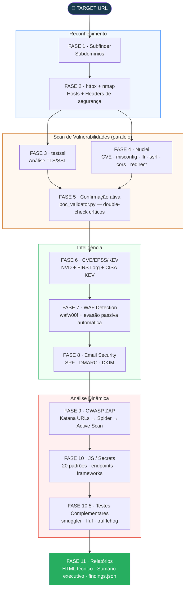

# SWARM

> Scanner de segurança web automatizado — pipeline de 11 fases, relatório HTML PT-BR orientado a tech leads e gestores de segurança.

[](https://www.gnu.org/software/bash/)
[](https://www.python.org/)
[](#instalação)
[](#uso)
[](LICENSE)

---

## Arquitetura



---

## Uso

```bash
# Scan único
bash swarm.sh https://target.com

# Scan autenticado (APIs com JWT)
bash swarm.sh https://api.target.com --token "eyJhbGci..."
bash swarm.sh https://api.target.com --header "Cookie: session=abc123"

# Múltiplos alvos
bash swarm_batch.sh targets.txt

# Comparar dois scans
python3 swarm_diff.py scan_anterior/ scan_novo/ --html

# Debug do validador de PoC
python3 lib/poc_validator.py scan_target_*/
```

> **Checkpoint:** scan interrompido retoma automaticamente. Para reiniciar do zero: `rm -rf scan_target.com_*/`

### Arquivo de alvos

```
# Uma URL por linha — # são comentários
https://app.empresa.com.br
https://api.empresa.com.br
staging.empresa.com.br       # https:// adicionado automaticamente
```

---

## Estrutura do repositório

```
swarm/
├── swarm.sh                  ← scanner principal
├── swarm_batch.sh            ← orquestrador multi-target
├── swarm_diff.py             ← comparação entre scans
├── swarm_report.py           ← gerador de relatório standalone
├── test_swarm.sh             ← 158 testes automatizados
├── install.sh                ← instalador automático
├── Dockerfile                ← imagem Docker oficial
├── INSTALACAO.md             ← guia passo a passo para iniciantes
└── lib/
    ├── poc_validator.py      ← módulo de confirmação de evidências
    └── vuln_patterns.json    ← padrões externos extensíveis por tipo
```

---

## Output de cada scan

```
scan_target.com_20260502_143022/
├── relatorio_swarm.html          ← relatório técnico completo
├── sumario_executivo.html        ← 1 página para gestores (sem evidência técnica)
├── findings.json                 ← schema fixo para SIEM/API/integração
└── raw/
    ├── .swarm_state              ← checkpoint de fases
    ├── .phase_times              ← duração de cada fase
    ├── subdomains.txt
    ├── httpx_results.txt
    ├── nmap.txt
    ├── security_headers.json     ← CSP, HSTS, X-Frame-Options, etc.
    ├── testssl.json
    ├── nuclei.json
    ├── nuclei_urls.txt           ← URLs Katana + domínio para Nuclei
    ├── exploit_confirmations.json
    ├── kev_matches.json          ← CVEs com exploração ativa (CISA)
    ├── cve_enrichment.json       ← CVSS + EPSS + KEV
    ├── waf.json
    ├── email_security.json
    ├── scan_metadata.json
    ├── katana_urls.txt
    ├── zap_alerts.json
    ├── zap_evidencias.xml
    ├── js_analysis.json
    ├── ffuf.json
    ├── ffuf_wordlist.txt
    ├── smuggler.txt
    └── trufflehog.json
```

---

## Metodologia de Classificação de Criticidade

**Priorização em 4 camadas — evidência de exploração real supera severidade teórica.**

### Camada 1 — KEV (peso máximo)
[CISA Known Exploited Vulnerabilities](https://www.cisa.gov/known-exploited-vulnerabilities-catalog) — exploração ativa confirmada em ambiente real. Catálogo baixado a cada scan com cache de 24 horas. Um CVE no KEV recebe **+25 pontos** independente do CVSS.

### Camada 2 — EPSS
[Exploit Prediction Scoring System](https://www.first.org/epss) — probabilidade de exploit nos próximos 30 dias:

| EPSS | Bônus |
|---|---|
| ≥ 50% | +15 |
| ≥ 10% | +7 |
| ≥ 1% | +2 |

### Camada 3 — CVSS v3
Severidade técnica base do NVD. Usado como ponto de partida — não como critério exclusivo.

### Camada 4 — Validação ativa (`poc_validator.py`)
Re-executa o curl de cada achado Nuclei C/A/M com baseline inteligente e double-check para críticos.

### Fórmula do Risk Score (0–100)

```
base_risk  = (críticos × 10) + (altos × 5) + (médios × 2) + baixos
kev_bonus  = min(CVEs_KEV × 25, 50)
epss_bonus = Σ bônus por CVE
js_bonus   = min(secrets × 15 + fw_vulneráveis × 8, 30)
risk       = min(base + kev + epss + js, 100)
```

| Score | Classificação | Ação |
|---|---|---|
| 70–100 | CRÍTICO | Escalar hoje |
| 40–69 | ALTO | Corrigir esta sprint |
| 15–39 | MÉDIO | Próximo sprint |
| 0–14 | BAIXO | Backlog |

---

## PoC Validator — Confirmação Inteligente de Evidências

O `lib/poc_validator.py` é o módulo dedicado de confirmação de evidências. Funciona de forma independente e é chamado automaticamente na Fase 5.

### Como funciona

Baseline inteligente com valor inócuo: o validator substitui o payload malicioso por `"safe-test-value"` antes de fazer o request de comparação — eliminando o ruído de diferenças de rota.


1. **Baseline com valor inócuo** — substitui o payload malicioso por `"safe-test-value"` antes de fazer o request de comparação. A diferença entre as respostas confirma o efeito do payload
2. **Normalização antes do diff** — remove tokens dinâmicos (CSRF, session IDs, timestamps, ETags) antes de comparar. Elimina falsos positivos em endpoints com CSRF
3. **Padrões externos** (`lib/vuln_patterns.json`) — indicadores por tipo de vulnerabilidade em JSON com suporte a regex. Extensível sem modificar código
4. **Double-check para críticos** — achados CRITICAL são executados 2x com 3s de intervalo. Comportamento consistente → +10% confiança. Comportamento instável → sinaliza intermitência
5. **Multi-method** — testa GET e POST para detectar diferenças de comportamento por método

### Score de confiança

| Tipo | Evidência fraca | Evidência forte |
|---|---|---|
| SQLi | 35% (sem indicador) | 97% (erro SQL no body) |
| XSS | 25% (sem reflexão) | 97% (payload refletido) |
| LFI | 30% (sem conteúdo) | 99% (root:x:0:0 no body) |
| CORS | 15% (sem header) | 98% (wildcard + credentials=true) |
| Default Login | 25% (sem indicador) | 98% (cookie de sessão criado) |
| Exposure | 55% (acessível) | 95% (chave=valor em formato config) |

### Adicionar novos padrões

Edite `lib/vuln_patterns.json` — sem tocar no código:

```json
"sqli": {
  "patterns": [
    "sql syntax",
    "ORA-[0-9]{5}",
    "PostgreSQL query failed",
    "seu novo pattern aqui"
  ]
}
```

---

## Cobertura

### Reconhecimento
- Enumeração de subdomínios — pula automaticamente se alvo já é subdomínio/API ou TLD composto (.com.br, .co.uk)
- Mapeamento HTTP (httpx) e portas (nmap): 80, 443, 8000, 8080, 8443, 8888, 3000, 9090
- **Headers de segurança** — verifica CSP, HSTS, X-Frame-Options, X-Content-Type-Options, Referrer-Policy, Permissions-Policy em todas as URLs ativas

### Scan de Vulnerabilidades (Nuclei)
- CVE, misconfiguration, default credentials, exposure, takeover, CORS, **LFI, SSRF, Open Redirect**
- **Input enriquecido** — Nuclei roda nas URLs descobertas pelo Katana + domínio raiz, aumentando cobertura em SPAs e APIs REST

### Inteligência CVE (KEV > EPSS > CVSS)
- NVD (CVSS v3), FIRST.org (EPSS), CISA KEV (exploração ativa)
- Cache KEV de 24h — sem download repetido por scan
- Badge 🔴 KEV no sumário e nos cards de achado
- **Link direto** para `nvd.nist.gov/vuln/detail/CVE-XXXX` em cada achado

### WAF Detection & Evasão Passiva
- wafw00f detecta 140+ WAFs
- Quando detectado: rate limit 5 req/s, UA rotation, X-Forwarded-For spoofing, payload alterations, ZAP threads=2

### Scan Autenticado
- `--token "Bearer eyJ..."` — injeta JWT no ZAP e Nuclei
- `--header "Cookie: session=..."` — qualquer header de autenticação

### Testes Complementares (Fase 10.5)
- **smuggler.py** — HTTP Request Smuggling (CL.TE, TE.CL, CL.0)
- **ffuf** — fuzzing com wordlist customizada para hotelaria/pagamentos
- **trufflehog** — secrets de alta confiança nos JS coletados

### Relatórios
- **HTML técnico** — cards únicos com badge KEV, CVSS, EPSS, link NVD, evidência request/response completa, curl reproduzível, nota PoC, score de confiança
- **Sumário executivo** — 1 página para gestores, sem evidência técnica, com tempo por fase
- **findings.json** — schema versionado (v1.0) para integração com SIEM/API/JIRA

---

## Instalação

```bash
git clone https://github.com/trickMeister1337/SWARM.git
cd SWARM
bash install.sh
```

### Manual — Kali Linux / Ubuntu / WSL

```bash
# Sistema
sudo apt update && sudo apt install -y \
    curl python3 python3-pip jq nmap git zaproxy testssl chromium golang-go

# Python
pip3 install requests pdfminer.six wafw00f --break-system-packages

# Go tools
go install github.com/projectdiscovery/subfinder/v2/cmd/subfinder@latest
go install github.com/projectdiscovery/httpx/cmd/httpx@latest
go install github.com/projectdiscovery/nuclei/v3/cmd/nuclei@latest
go install github.com/projectdiscovery/katana/cmd/katana@latest
go install github.com/ffuf/ffuf/v2@latest
nuclei -update-templates

# trufflehog
curl -sSfL https://raw.githubusercontent.com/trufflesecurity/trufflehog/main/scripts/install.sh \
    | sudo sh -s -- -b /usr/local/bin

# smuggler
git clone https://github.com/defparam/smuggler ~/tools/smuggler

# PATH
echo 'export PATH=$PATH:$HOME/go/bin' >> ~/.bashrc
echo 'export PATH=$PATH:$HOME/.local/bin' >> ~/.bashrc
source ~/.bashrc
```

### Docker

```bash
docker build -t trickmeister1337/swarm .
docker run --rm -v $(pwd)/output:/swarm/output trickmeister1337/swarm https://target.com
```

---

## Validação

```bash
bash test_swarm.sh
# Esperado: 158/158 — 0 falhas, 0 avisos
```

---

## Referência de Ferramentas

| Ferramenta | Fase | Obrigatória |
|---|---|---|
| `curl`, `python3` | Todas | ✅ Sim |
| `subfinder`, `httpx`, `nmap` | 1–2 | Opcional |
| `testssl` | 3 | Opcional |
| `nuclei` | 4 | Opcional |
| `wafw00f` | 7 | Opcional |
| `katana`, `zaproxy`, `chromium` | 9 | Opcional |
| `ffuf` + seclists | 10.5 | Opcional |
| `smuggler.py` | 10.5 | Opcional |
| `trufflehog` | 10.5 | Opcional |
| `dig` | 8 | Padrão do sistema |

---

## Comparação entre Scans

```bash
python3 swarm_diff.py scan_anterior/ scan_novo/         # terminal
python3 swarm_diff.py scan_anterior/ scan_novo/ --html  # relatório HTML
```

Identifica: ✗ Novas · ✓ Corrigidas · ~ Persistentes · Δ Risk Score

---

## Aviso Legal

> O SWARM destina-se exclusivamente a **testes de segurança autorizados**. O uso contra sistemas sem permissão escrita explícita é ilegal. Sempre obtenha autorização formal antes de executar avaliações de segurança.

---

## Contribuindo

1. Fork do repositório
2. `git checkout -b feature/sua-feature`
3. `bash test_swarm.sh` → 158/158
4. Pull request

---

## Licença

MIT — veja [LICENSE](LICENSE).
