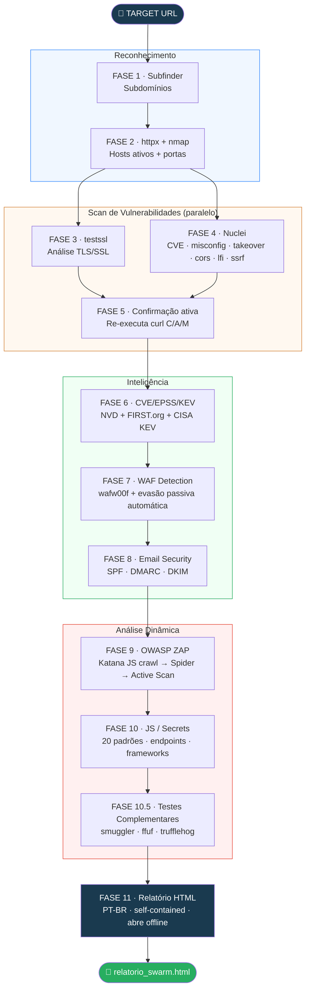

# SWARM

> Scanner de segurança web automatizado — pipeline de 11 fases, relatório HTML PT-BR orientado a tech leads e gestores de segurança.

[](https://www.gnu.org/software/bash/)
[](https://www.python.org/)
[](#instalação)
[](#uso)
[](LICENSE)

---

## Arquitetura



---

## Pipeline de 11 Fases

```
FASE 1    Subfinder ─────────────── Subdomínios (pula se já é subdomínio/API)
FASE 2    httpx + nmap ──────────── Hosts ativos + portas
FASE 3    testssl ────────────┐
                 (background) │ paralelo
FASE 4    Nuclei ─────────────┘
          CVE · misconfig · default-login · takeover · cors · lfi · ssrf · redirect
FASE 5    Confirmação ativa (C/A/M)
FASE 6    Enriquecimento CVE / EPSS / KEV — NVD + FIRST.org + CISA
FASE 7    WAF Detection + evasão passiva automática
FASE 8    Segurança de Email — SPF / DMARC / DKIM
FASE 9    OWASP ZAP — Katana → Spider → Active Scan + pre-warm de contexto
FASE 10   JS / Secrets — 20 padrões · endpoints · frameworks vulneráveis
FASE 10.5 Testes Complementares — smuggler · ffuf (wordlist customizada) · trufflehog
FASE 11   Relatório HTML — PT-BR · self-contained · abre offline
```

---

## Uso

```bash
# Scan único
bash swarm.sh https://target.com

# Scan autenticado (APIs com JWT)
bash swarm.sh https://api.target.com --token "eyJhbGci..."

# Scan com header customizado (Cookie, API-Key, etc.)
bash swarm.sh https://api.target.com --header "Cookie: session=abc123"

# Múltiplos alvos
bash swarm_batch.sh targets.txt

# Comparar dois scans (novas / corrigidas / persistentes)
python3 swarm_diff.py scan_anterior/ scan_novo/ --html
```

> **Checkpoint:** se um scan for interrompido, o SWARM retoma automaticamente as fases já concluídas ao rodar o mesmo comando. Para reiniciar do zero: `rm -rf scan_target.com_*/`

### Arquivo de alvos (`targets.txt`)

```
# Uma URL por linha — comentários com # são ignorados
https://app.empresa.com.br
https://api.empresa.com.br
staging.empresa.com.br        # https:// adicionado automaticamente
```

---

## Metodologia de Classificação de Criticidade

Priorização em 4 camadas — **evidência de exploração real supera severidade teórica**.

### Camada 1 — KEV (peso máximo)
[CISA Known Exploited Vulnerabilities](https://www.cisa.gov/known-exploited-vulnerabilities-catalog) — exploração ativa confirmada em ambiente real. Um CVE no KEV recebe +25 pontos independente do CVSS.

### Camada 2 — EPSS
[Exploit Prediction Scoring System](https://www.first.org/epss) — probabilidade de exploit nos próximos 30 dias: EPSS ≥50% = +15, ≥10% = +7, ≥1% = +2.

### Camada 3 — CVSS v3
Severidade técnica base. Limitação: NVD prioriza enriquecimento apenas para KEV e softwares críticos — CVEs recentes podem não ter CVSS imediato.

### Camada 4 — Validação ativa
Re-executa o curl de cada achado Nuclei C/A/M para confirmar explorabilidade no alvo real.

### Fórmula do Risk Score (0–100)

```
base_risk  = (críticos × 10) + (altos × 5) + (médios × 2) + baixos
kev_bonus  = min(CVEs_no_KEV × 25, 50)
epss_bonus = Σ bônus por CVE
js_bonus   = min(secrets × 15 + fw_vulneráveis × 8, 30)
risk       = min(base + kev + epss + js, 100)
```

| Score | Classificação | Ação |
|---|---|---|
| 70–100 | CRÍTICO | Escalar hoje |
| 40–69 | ALTO | Corrigir esta sprint |
| 15–39 | MÉDIO | Próximo sprint |
| 0–14 | BAIXO | Backlog |

---

## Cobertura

### Reconhecimento
- Enumeração de subdomínios (subfinder) — pula automaticamente se alvo já é subdomínio/API
- Mapeamento HTTP (httpx) e scan de portas (nmap): 80, 443, 8000, 8080, 8443, 8888, 3000, 9090
- Detecção automática de TLDs compostos (.com.br, .co.uk) — não confunde com subdomínio

### TLS / SSL
Versões de protocolo, cipher suites fracos, HSTS, CVEs: Heartbleed, POODLE, BEAST, ROBOT, DROWN.

### Scan de Vulnerabilidades (Nuclei)
CVE, misconfiguration, default credentials, exposure, subdomain takeover, CORS, **LFI, SSRF, Open Redirect**.

### Inteligência CVE (KEV > EPSS > CVSS)
NVD (CVSS v3), FIRST.org (EPSS), CISA KEV (exploração ativa). Badge 🔴 KEV no relatório quando detectado.

### WAF Detection & Evasão Passiva
wafw00f detecta 140+ WAFs. Quando detectado, adapta automaticamente:
- Rate limit → 5 req/s com delay 1–3s
- User-Agent rotation (Chrome, Firefox, Safari, Edge)
- Origin spoofing (X-Forwarded-For, X-Real-IP)
- Payload alterations (-pa), ZAP threads reduzidas para 2

### Scan Autenticado (opcional)
- `--token "Bearer eyJ..."` — injeta JWT no ZAP e Nuclei
- `--header "Cookie: session=..."` — qualquer header de autenticação
- ZAP active scan cobre rotas protegidas quando autenticado

### Segurança de Email
SPF, DMARC, DKIM via `dig` — sem ferramentas extras.

### Análise Dinâmica (Katana + ZAP)
- Katana com JS headless (`-jc -jsl`) antes do spider
- Pre-warm: injeta /api, /graphql, /login, robots.txt no contexto ZAP
- Deduplicação, reclassificação CVSS por CWE (37 entradas), evidência completa

### JavaScript & Secrets
20 padrões (AWS, JWT, Stripe, Firebase, DB strings, chaves privadas, Slack...), frameworks com versão, endpoints, probing ativo, comentários sensíveis.

### Testes Complementares (Fase 10.5)
- **smuggler.py** — HTTP Request Smuggling (CL.TE, TE.CL, CL.0)
- **ffuf** — fuzzing com wordlist customizada para hotelaria/pagamentos (api, booking, payment, reservation, checkout, admin...)
- **trufflehog** — secrets de alta confiança nos JS coletados

### Relatório em PT-BR
Badges CRÍTICO/ALTO/MÉDIO/BAIXO/INFO, card 🔴 KEV, evidência HTTP completa sem truncagem, comportamento do scan com evasão ativa, plano de ação 3 horizontes, duração total.

---

## Instalação

```bash
git clone https://github.com/trickMeister1337/SWARM.git
cd SWARM
bash install.sh
```

### Manual — Kali Linux

```bash
sudo apt update && sudo apt install -y \
    curl python3 python3-pip jq nmap git zaproxy testssl chromium golang-go

pip3 install requests pdfminer.six wafw00f --break-system-packages

go install github.com/projectdiscovery/subfinder/v2/cmd/subfinder@latest
go install github.com/projectdiscovery/httpx/cmd/httpx@latest
go install github.com/projectdiscovery/nuclei/v3/cmd/nuclei@latest
go install github.com/projectdiscovery/katana/cmd/katana@latest
go install github.com/ffuf/ffuf/v2@latest
go install github.com/trufflesecurity/trufflehog/v3@latest
nuclei -update-templates

git clone https://github.com/defparam/smuggler ~/tools/smuggler

echo 'export PATH=$PATH:$HOME/go/bin' >> ~/.bashrc
echo 'export PATH=$PATH:$HOME/.local/bin' >> ~/.bashrc
source ~/.bashrc
```

### Manual — Ubuntu / WSL

```bash
sudo apt update && sudo apt install -y \
    curl python3 python3-pip jq nmap git zaproxy testssl chromium-browser golang-go

pip3 install requests pdfminer.six wafw00f --break-system-packages

# Ferramentas Go
go install github.com/projectdiscovery/subfinder/v2/cmd/subfinder@latest
go install github.com/projectdiscovery/httpx/cmd/httpx@latest
go install github.com/projectdiscovery/nuclei/v3/cmd/nuclei@latest
go install github.com/projectdiscovery/katana/cmd/katana@latest
go install github.com/ffuf/ffuf/v2@latest

# trufflehog (requer Go >= 1.25)
curl -sSfL https://raw.githubusercontent.com/trufflesecurity/trufflehog/main/scripts/install.sh | sudo sh -s -- -b /usr/local/bin

# smuggler
git clone https://github.com/defparam/smuggler ~/tools/smuggler

nuclei -update-templates

echo 'export PATH=$PATH:$HOME/go/bin' >> ~/.bashrc
echo 'export PATH=$PATH:$HOME/.local/bin' >> ~/.bashrc
# WSL
echo 'export DISPLAY=""' >> ~/.bashrc
echo 'export JAVA_TOOL_OPTIONS="-Djava.awt.headless=true"' >> ~/.bashrc
source ~/.bashrc
```

---

## Validação

```bash
bash test_swarm.sh
# Esperado: 158/158 — 0 falhas, 0 avisos
```

---

## Estrutura de Output

```
scan_target.com_20260424_143022/
├── relatorio_swarm.html            ← abrir no browser
└── raw/
    ├── .swarm_state                ← checkpoint de fases (resume automático)
    ├── subdomains.txt
    ├── httpx_results.txt
    ├── nmap.txt
    ├── testssl.json
    ├── nuclei.json
    ├── exploit_confirmations.json
    ├── kev_matches.json            ← CVEs com exploração ativa (CISA)
    ├── cve_enrichment.json         ← CVSS + EPSS + KEV
    ├── waf.json / waf_name.txt
    ├── email_security.json
    ├── scan_metadata.json          ← comportamento + evasão
    ├── katana_urls.txt
    ├── zap_alerts.json
    ├── zap_evidencias.xml          ← request/response completo
    ├── js_analysis.json
    ├── js_files/
    ├── ffuf.json                   ← endpoints por fuzzing
    ├── ffuf_wordlist.txt           ← wordlist customizada gerada
    ├── smuggler.txt
    └── trufflehog.json
```

```
scan_batch_20260424_143022/
├── relatorio_consolidado.html
├── batch_summary.log
├── logs/
└── scan_*/
```

---

## Seções do Relatório

| # | Seção |
|---|---|
| 1 | Sumário Executivo — risco, card 🔴 KEV, contadores, duração |
| 2 | Superfície de Ataque |
| 3 | Vulnerabilidades (badge KEV, CVSS, EPSS, evidência completa) |
| 4 | Comportamento do Scan & Evasão Passiva |
| 5 | Infraestrutura & DNS (WAF + SPF/DMARC/DKIM) |
| 6 | TLS / SSL |
| 7 | Confirmação Ativa |
| 8 | JS / Secrets |
| 9 | Baixo / Info |
| 10 | Plano de Ação (esta semana / sprint / backlog) |
| 11 | Arquivos de Evidência |

---

## Comparação entre Scans

```bash
python3 swarm_diff.py scan_anterior/ scan_novo/         # terminal
python3 swarm_diff.py scan_anterior/ scan_novo/ --html  # relatório HTML
```

Identifica: ✗ Novas · ✓ Corrigidas · ~ Persistentes · Δ Risk Score

---

## Referência de Ferramentas

| Ferramenta | Fase | Obrigatória |
|---|---|---|
| `curl`, `python3` | Todas | ✅ Sim |
| `subfinder`, `httpx`, `nmap` | 1–2 | Opcional |
| `testssl` | 3 | Opcional |
| `nuclei` | 4 | Opcional |
| `wafw00f` | 7 | Opcional |
| `katana`, `zaproxy`, `chromium` | 9 | Opcional |
| `ffuf` + seclists | 10.5 | Opcional |
| `smuggler.py` | 10.5 | Opcional |
| `trufflehog` | 10.5 | Opcional |
| `dig` | 8 | Padrão do sistema |

---

## Aviso Legal

> O SWARM destina-se exclusivamente a **testes de segurança autorizados**. O uso contra sistemas sem permissão escrita explícita é ilegal. Sempre obtenha autorização formal antes de executar avaliações de segurança.

---

## Contribuindo

1. Fork do repositório
2. `git checkout -b feature/sua-feature`
3. `bash test_swarm.sh` → 158/158
4. Pull request

---

## Licença

MIT — veja [LICENSE](LICENSE).
